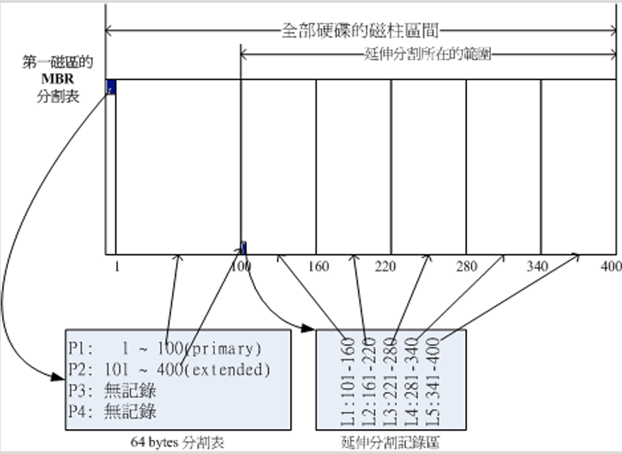
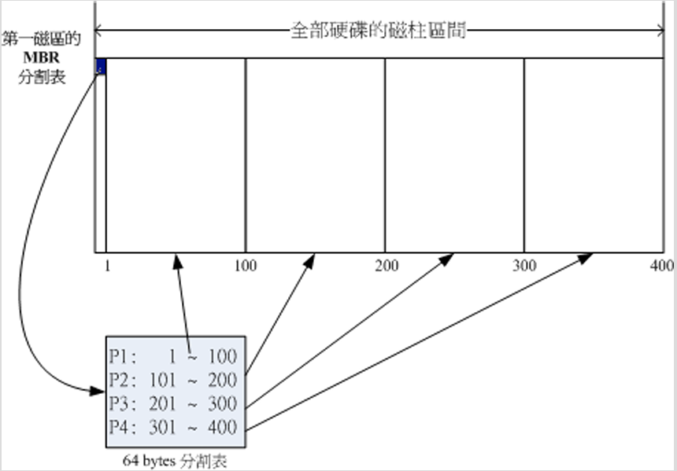

# 主要分割、延伸分割、逻辑分割

### 挂载
- 挂载 - 就是利用一个目录当成进入点，将磁盘分区槽的数据放置在该目录下。也就是说，进入该目录就可以读取该分割槽的意思。
	- 这个动作称为挂载
	- 进入点的目录称为挂载点
	- Linux最重要的是根目录，一定要挂载到某个分割槽
	- 其他目录可按照用户的需求挂载到不同的分割槽

### 磁盘为什么要分割？
1. 数据的安全性
	- 每个分割槽的数据是可以分开的。例如：Windows的系统装在C盘，重装系统时，可以只重装C，而保留D盘的数据。
2. 系统的性能
	- 分割槽将数据**集中**在某个磁柱的区段。例如：第一个分割槽位于磁柱号码1~100，当从该分割槽读取数据时，只需要扫描1~100的磁柱范围就可以了，因为要用到的数据都集中在这里，这有助于数据读取的速度与效能。

### 主要分割 & 延伸分割 & 逻辑分割
##### 定义
- 主要分割(Primary)/ 延伸分割(Extended) - 针对64 bytes的分区表进行设置的分区，硬盘默认的分区表仅能写入4组分区信息，这4组分区信息称为主要或延伸分区。主要分割与延伸分割最多可以有4笔（硬盘的限制）。每组分区表仅有16 bytes，因此可记录的信息相当有限。
-  延伸分区的目的是使用额外的扇区来记录分区信息，延伸分区本身并不能被格式化。延伸分割最多只能有一个（操作系统的限制）。
- 逻辑分割(logical) -  由延伸分割继续分割出来的分割槽就是**逻辑分割槽(logical parition)**
- 能够被格式化后，作为数据存取的分割槽为主要分割与逻辑分割
- 逻辑分割的数量依操作系统而不同，在Linux系统中，IDE硬盘最多有59个逻辑分割（5号到63号），SATA硬盘则有11个逻辑分割（5号到15号）（现在在Linux系统中SATA硬盘已经可以突破63个以上的分区限制了）。
##### 区别
- 主要分割和逻辑分割在Linux系统中的装置文件名：
	- P1: /dev/hda1
	- P2: /dev/hda2
	- P3: /dev/hda3
	- P4: /dev/hda4
- 逻辑分割在Linux系统中的装置的文件名：
	- L1: /dev/hda5
	- L2: /dev/hda6
	- L3: /dev/hda7
	- L4: /dev/hda8

注意：即便没有/dev/hda3和/dev/hda4，逻辑分割槽也是从/dev/hda5开始。/dev/hda1、/dev/hda2、/dev/hda3、/dev/hda4 都是保留给主要分割和延伸分割的。

### 两个分割槽可以合并成一个分割槽吗？
- 如果两个分割槽相邻而且同属于延伸分割内的逻辑分割，只需要将两个分割槽删除，再重新建立一个新的分割槽，就能够在不影响其他分割槽的情况下，将两个分割槽的容量整合成一个。
- 如果两个分割槽分别属于主分割和逻辑分割，两者不能够整合在一起。除非将延伸分割破坏掉后再重新分割，但这样做会影响到所有的逻辑分割槽。如果延伸分割被破坏，所有逻辑分割都将会被删除，因为逻辑分割的信息都记录在延伸分割里。

### 磁盘分区
#### MBR分区表格式
- 主要启动记录区(Master Boot Record, MBR)，有512 bytes：
	- 安装开机管理程序的地方，有446 bytes
	- 分割表(partition table)：记录整个硬盘分割的状态，64 bytes
- 由于分割表只有64 bytes, 最多只能容纳4笔分割记录，这4个分割的记录被称为**主要(Primary)或延伸(Extended)分割槽**。
- 分割槽的最小单位是磁柱(cylinder)

#### GPT磁盘分区表
- GPT (GUID partition table)
- GPT使用了34个LBA区块来记录分区信息
- 整个磁盘最后的34个LBA也用来作为前34个区块的备份
![[img/006.GPT分区表结构示意图.png]]

- **LBA0** 
	- 储存了第一阶段的开机管理程序。
	- 仅放入一个特殊标志的分区，用来表示此磁盘为GPT格式之意。不懂GPT分区表的磁盘管理程序，不会认识这颗磁盘。
- **LBA1**
	- 记录分区表本身的位置与大小
	- 记录备份用的GPT分区（最后34个LBA分区）
	- 放置了分区表的检验机制码(CRC32)，操作系统可以根据这个检验码来判断GPT是否正确。
- **LBA2-33**
	- 从LBA2区块开始，每个LBA都可以记录4笔分区记录，总共有$4^{32} = 128$笔分区记录
	- 每个LBA有512 bytes，每笔记录用到512/4=128 bytes
	- 除了每笔记录所需要的识别码和相关记录之外，每个记录中还有64bits可以用来记载开始/结束的扇区号码。