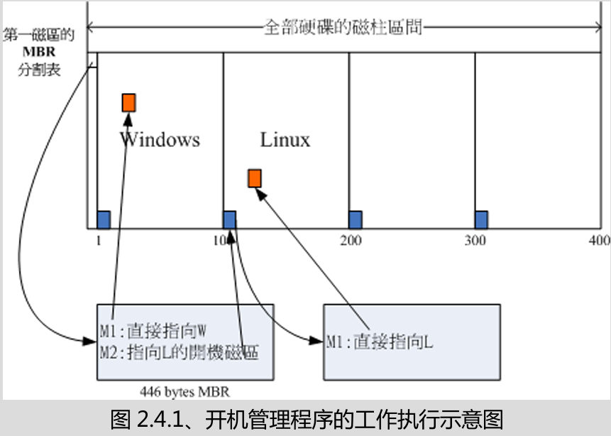

# BIOS

### 定义
- CMOS - 记录各项硬件参数且嵌入在主板上面的存储器
- BIOS - 写入到主板上的一个固件(firmware)
	- 固件就是写入到硬件上的一个软件程序。
	- BIOS是在开机的时候，计算机系统会主动执行的第一个程序

### 开机流程
1. BIOS：开机主动执行的固件，找到第一个可开机的装置
2. MBR：第一个可开机装置的第一个扇区内的主要启动记录区块，内含开机管理程序
3. 开机管理程序(boot loader)：一个可读取核心文件来执行的软件
	1. 提供选单：用户可以选择不同的开机项目（多重引导也是这个功能）
	2. 载入核心文件：直接指向可开机的程序区段来开始操作系统
	3. 转交其他loader：将开机管理功能转交给其他loader负责
4. 核心文件：开始操作系统的功能

由于 boot loader 既可以安装在MBR中，还可以安装在每个分割槽的启动扇区(boot sector)中
- 每个分区都拥有自己的开机扇区（boot sector）
- 实际可开机的核心文件是放置到各分区内的
- loader只会认识自己的系统盘内的可开机核心文件，以及其他loader
- loader可直接指向或是间接将管理权转交给另一个管理程序

##### 为什么Windows和Linux双系统，要先安装Windows再安装Linux？
- Linux在安装的时候，可以选择将开机管理程序安装在MBR或别的分区的开机扇区，而且Linux的loader可以手动设置菜单，所以你可以在Linux的boot loader里面加入Windows开机的选项。
- Windows在安装的时候，他的安装程序会主动覆盖掉MBR以及自己所在分区的开机扇区，而且没有让我们自己选择菜单的功能。

# UEFI
- BIOS不懂GPT
> UEFI = Unified Extensible Firmware Interface 统一可延伸固件界面

- 由于黑客们经常在BIOS开机阶段来破坏系统，并取得系统的控制权，因此UEFI加入了一个安全启动(secure boot)机制，这个机制代表着即将开机的操作系统必须要被UEFI所验证，否则就无法顺利开机。
- 这个机制可能会导致Linux无法正常启动，有时候需要关闭secure boot功能才能正常启动Linux。

